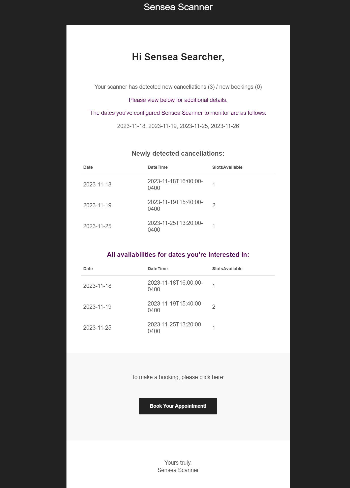

# sensea-scanner

Sensea Scanner is a tool to help you book a reservation at Sensea. It will monitor the dates you are interested in and email you when new slots become available. You can configure it to only email you if X slots become available for the same time slot. See an example of the emails it sends below.

To use it you can run the npm task `npm run start:daemon` this will use `forever` to keep the script running as a daemon. To stop the daemon you can run the npm task `npm run stop:daemon`.

Before running the app you need to configure it. Copy the `config.example.ts` file and name the new copy `config.ts`. Follow [this tutorial](https://medium.com/@nickroach_50526/sending-emails-with-node-js-using-smtp-gmail-and-oauth2-316fe9c790a1) to set up a google account capable of sending emails.

Add the email configuration as well as the dates you're interested in monitoring into the new `config.ts` file and you should be ready to run the app.

## Sample Output

Sensea scanner will email the email address of your choice with a email similar to this:

